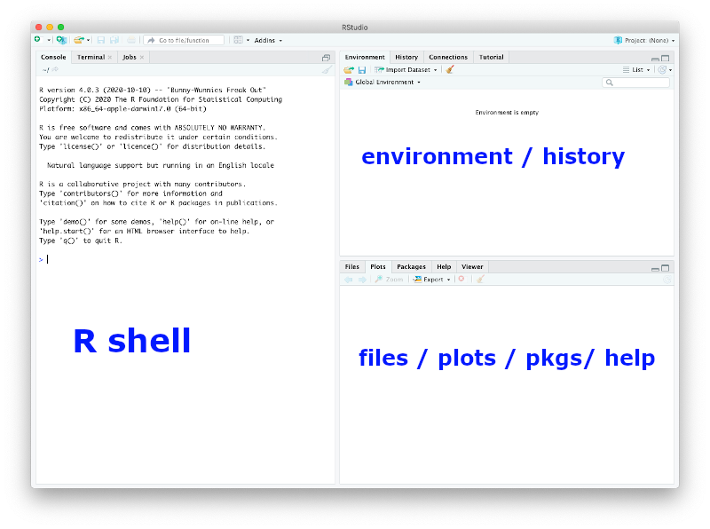
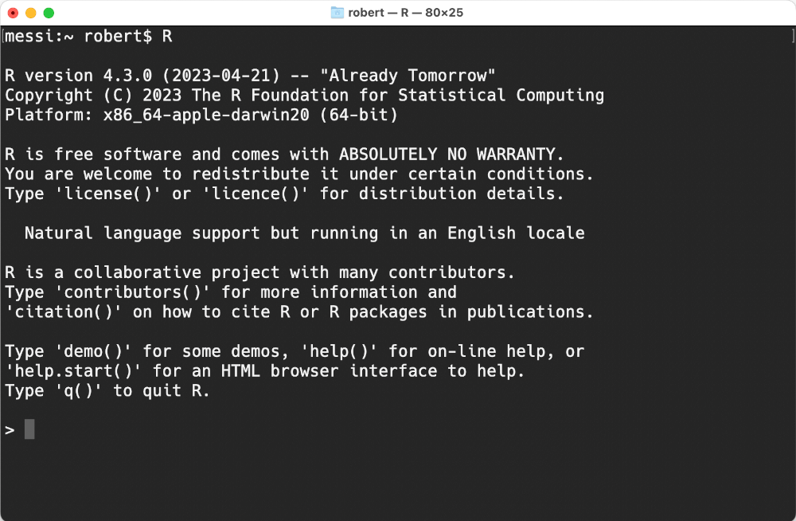
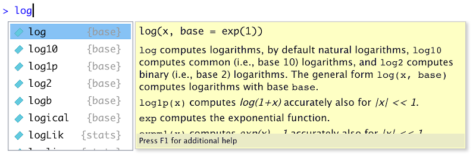
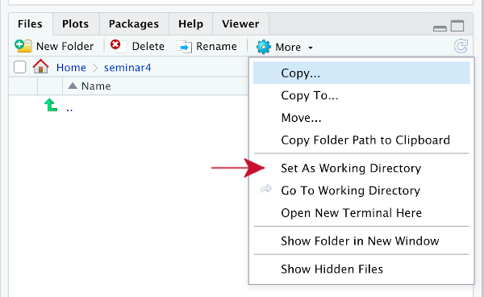

```{r setup, include=FALSE, cache=FALSE}
options(htmltools.dir.version = FALSE, width=80)
knitr::opts_chunk$set(warning = FALSE,
                      message = FALSE,
                      cache=TRUE,
                      collapse=TRUE,
                      prompt=TRUE,
                      fig.align="center",
                      comment="")

## from http://yihui.name/knitr/hooks#chunk_hooks
knitr::knit_hooks$set(small.mar=function(before, options, envir) {
                                              if (before) par(mar=c(4, 5, 1, 1)) ## smaller margin on top and right
})
```

class: title-slide, middle, center

# Get started with R and RStudio

## Robert Castelo
[robert.castelo@upf.edu](mailto:robert.castelo@upf.edu)
### Dept. of Medicine and Life Sciences
### Universitat Pompeu Fabra

<br>

## Fundamentals of Computational Biology
### BSc on Human Biology
### UPF School of Health and Life Sciences
### Academic Year 2023-2024

---


# Setup and background

* To follow these slides you need an installation of 
  [R](https://www.r-project.org) and [RStudio](https://posit.co/downloads).
  You should install R **first** and only once R has been installed,
  then you should install RStudio.  
  &nbsp;&nbsp; 
* You can find installation instructions in the
  [setup](https://funcompbio.github.io/setup/#r-and-rstudio) link on how to
  install R **and** RStudio in your system. Once R and RStudio are installed,
  you should be able to start RStudio by double-clicking on an icon like the
  one here below.


---

# Setup and background

* To illustrate the use of R and RStudio, we will use the data files called
  `mostres_analitzades.csv` and `virus_detectats.csv` that were generated
  in the [first practical](https://funcompbio.github.io/practical1) from the
  infection surveillance system of Catalonia
  ([SIVIC](https://sivic.salut.gencat.cat) in its Catalan acronym).  
  &nbsp;&nbsp;
* If you don't have these files, please review that practical and generate them
  again. Once you have obtained those two files, copy them into a fresh new
  directory called `seminar4`.

---

# Starting R and RStudio

* RStudio is the most popular graphical user interface (GUI), or rather the most
  popular
  [integrated development environment (IDE)](https://en.wikipedia.org/wiki/Integrated_development_environment),
  for working **with** R. However, **RStudio is not R, RStudio runs R**. You can
  also run and work with R **without** RStudio.  
  &nbsp;&nbsp;
* If you need to work with R in a remote server, then either that remote server
  runs [RStudio server](https://posit.co/products/open-source/rstudio-server/)
  and you can connect to it through a web browser or, alternatively, you only
  have a text-based connection through a terminal window and then you **cannot**
  use RStudio but your can use R on the Unix command-line.  
  &nbsp;&nbsp;
* If for whatever reason, you cannot use RStudio, you can still follow these
  slides, skipping the parts that specifically refer to the GUI of RStudio.

---

# Starting R and RStudio

* The RStudio window is initially divided in three main panes:

.pull-left[
* **R shell / prompt:** where you can interactively type R commands.  
  &nbsp;&nbsp;
* **Environment / history:** where you can browse through the
  objects that are being created and the commands that you have
  typed in the R shell.
]
.pull-right[

]

* **Files / plots / pkgs / help:** where you can navigate through
  the filesystem where RStudio is running and change the working
  directory, visualize plotting output, browse through the loaded
  packages and read help pages.

---

# Starting R and RStudio

* If you cannot start RStudio but you have installed R, you still can start
R by typing on the Unix shell command line:

    <pre>
    $ R
    </pre>

* Your terminal window should then be running R and looking similar to the one
  below.



---

class: small-code

# Quitting R and RStudio

* To quit R and RStudio you should type the following instruction in the
R shell:
  <pre>
  > q()
  </pre>
* You **should not** type the `>` character, since it corresponds to the R
  prompt and only indicates that the given instruction to the right of that
  character should be typed in the R shell. Normally, after that instruction
  R will ask:
  <pre>
  > q()
  Save workspace image? [y/n/c]:
  </pre>
* If you answer `y` then R will store all the objects you created in a
  hidden file called `.RData` and next time you start R, all those objects will
  be automatically loaded.  
  &nbsp;&nbsp;
* Unless you have a reason to save the workspace when quitting, **you should
  always answer `n` to that question**; answer `c` _cancels_ the quitting
  instruction.  
  &nbsp;&nbsp;
* In RStudio you can also quit R and RStudio by either closing the application
  window or through the `Quit` option in the _File_ or _RStudio_ top-level menu.

---

# R as a calculator

* The R shell can be directly used as a calculator, type the following
  instructions and figure out what the operators do:
<pre>
> 1+1
> 5-4
> 3*2
> 6/2
> 4%%3
> 2**3
> 2^3
</pre>

---

# R as a calculator

* Type the following and press enter:
<pre>
> 1+
</pre>
* You should have obtained the following output:
<pre>
&gt; 1+
+
</pre>
where the cursor is next to the plus sign (`+`) that has appeared in the
line below. This plus sign indicates that the expression you have written
is incomplete.  
&nbsp;&nbsp;
* This often happens when there is, for instance, a missing
closing parenthesis. In this situation you can do two things: (1) you
complete the instruction or (2) you press the `Esc` key, which will cancel
the instruction. Try cancelling this incomplete sum with the `Esc` key.

---

# RStudio contextual help

* Try to calculate the natural logarithm of 10 by typing:
<pre>
&gt; log(10)
</pre>
  If you are using RStudio, note that when you have typed the name of the
  function `log`, RStudio shows you a popup with contextual help, which
  you can use to choose among functions that have `log` as a prefix in their
  name.



---

# Getting and setting the working directory

* Whenever we want to read or write data files to a specific working directory,
we need to make sure that the default directory access or R is pointing to that
directory, just as with current working directory (CWD) in the
Unix filesystem.  
&nbsp;&nbsp;
* To find out the default working directory of R, you should call the `getwd()`
  function in the R shell:
  <pre>
  > getwd()
  </pre>
* If the returned path is not the working directory that we want, we can change
  it with the function `setwd(dir)` where `dir` should be the path that we want
  to set as working directory.  
  &nbsp;&nbsp;

---

# Getting and setting the working directory

* In RStudio, using the _Files_ pane, we can navigate through the file system
  to the directory we want to set as working directory and then click on the
  `More` pull-down menu and select `Set As Working Directory`.  



* Using the function `setwd()`, or the RStudio _Files_ pane, change the working
  directory to the folder `seminar4` that you should have created at the
  beginning of this document, and where you have downloaded the files
  `mostres_analitzades.csv` and `virus_detectats.csv`.

---

# Reading CSV files

* We can read CSV files in R using the function `read.csv()`. Let's read the CSV
  file `virus_detectats.csv` as follows:

  ```{r}
  dat <- read.csv("virus_detectats.csv", stringsAsFactors=TRUE)
  ```
* Note that when writing the first letters of the filename, you can
  _autocomplete_ the rest of the filename by pressing the `TAB` key.  
  &nbsp;&nbsp;
* Next to the filename as a first argument, we also specified that we want R
  to treat character columns as a special kind of object called _factor_.  
  &nbsp;&nbsp;
* The `read.csv()` function in R is analogous to the `read_csv()` function
  in the
  [Python module _pandas_](https://pandas.pydata.org/docs/reference/api/pandas.read_csv.html).

---

# Reading CSV files

* The `read.csv()` function returns a `data.frame` object. You can verify it by
  typing

  ```{r}
  class(dat)
  ```
* Figure out the dimensions of this `data.frame` object with the function `dim()`.  
  &nbsp;&nbsp;
* Examine the first and last rows of this `data.frame` object with the functions
  `head()` and `tail()`.  
  &nbsp;&nbsp;
* If you are running RStudio, go to the `Environment` pane
  and click on the small right triangle icon next to the object name and then
  over the object name.

---

class: small-code

# Reading CSV files

* A quick way to get a summary of the data stored in a `data.frame` object is
  by calling the function `summary()` with that object as argument. Call
  `summary()` on the previous `data.frame` object and you should be getting an
  output similar to this one:

```{r}
summary(dat)
```

---

# Subsetting rows of a data frame

**Exercise:** Using the previously loaded `data.frame` object, build a
vector of logical values (a so-called _logical mask_) in one-to-one
correspondence with the rows, where a position in the vector is `TRUE` if the
corresponding row contains data about the virus `SARS-CoV-2`; see section
see section on _Subsetting_ from
[this lecture](https://funcompbio.github.io/lecture6/#32).
If you store that _logical mask_ into an object called `mask`, the sum of its
truth values should give the following result:
```{r, echo=FALSE}
mask <- dat$virus == "SARS-CoV-2"
```
```{r}
sum(mask)
```

Using that logical mask, obtain a new `data.frame` object that includes only
data rows about the SARS-CoV-2 virus. Verify that the number of rows in the
new object matches the sum of `TRUE` values in the logical mask.

---

# Contingency tables

* A common operation on factor columns of a `data.frame` object is to cross
tabulate them, producing a so-called
[contingency table](https://en.wikipedia.org/wiki/Contingency_table). The
simplest contingency table consists of calculating the frequency distribution
of a single column factor:

```{r}
tab <- table(dat$virus)
tab
```
* Note that the object `tab` is a *named vector*. You can extract the
  names with:

```{r}
names(tab)
```

---

# Contingency tables

* Often, we may want to look at relative frequencies, rather than absolute
  ones, also known as proportions. In the previous example, we can either
  divide by the sum or use the function `proportions()`:

```{r}
tab/sum(tab)
proportions(tab)
```

---

# Contingency tables

* Interesting insights come often from looking at a multivariate frequency
  distribution obtained by cross-tabulating two or more factors:

```{r}
xtab <- table(dat$virus, dat$sexe)
xtab
```

---

# Contingency tables

* We can also easily obtain columnwise percentages by using the function
  `proportions()` with the argument `margin=2` and multiply them by 100:

```{r}
xtabpct <- proportions(xtab, margin=2)*100
xtabpct
```

---

# Simple plotting

* The main function to plot data points in (base) R is the function `plot()`.
  Type the following call to the `plot()` function in the R shell:
```{r, out.height="250px"}
x <- 1:10
plot(x, 2*x)
```
* Repeat again the last call adding the argument `type="l"`. What did this
argument change? Consult the
[help page of `plot()`](https://funcompbio.github.io/lecture6/#37) and find
out whether there a value for the parameter `type` that allows one to plot both,
dots and lines? 

---

# Simple plotting

* We can compare the previous percentages of infecting viruses between
  men and women as follows:

```{r, out.height="250px"}
plot(xtabpct[, "Home"], xtabpct[, "Dona"], xlab="Home", ylab="Dona")
abline(0, 1) ## draw a line where x == y
text(xtabpct[, "Home"], xtabpct[, "Dona"], rownames(xtabpct))
```
* Can you spot what viruses show more distinct percentages between
  men and women?

---

# Simple plotting

**Exercise:** Using the `data.frame` object storing the data from the CSV file
`virus_dectectats.csv`, build another `data.frame` object excluding rows with
the value `No disponible` in the column `sexe`. Using this new `data.frame`
object, cross tabulate the columns `virus` and `sexe` and figure out how
percentages of men and women change within each different infecting virus.

---

class: small-code

# Session information

```{r}
sessionInfo()
```
